# SimVascular Dependencies

## Overview

SimVascular uses a CMake superbuild to manage its external dependencies. All
libraries are built from source at pinned versions, with the exception of Qt6
which is expected to be pre-installed on the host system.

The superbuild is enabled by default (`SimVascular_SUPERBUILD=ON`). When
active, each dependency is cloned from its upstream repository, configured,
and built as a CMake `ExternalProject` before the inner SimVascular configure
runs.

---

## Dependencies

### Qt6 (system)
| | |
|---|---|
| **Version** | 6.10+ (host-provided) |
| **Components** | Core, CoreTools, Gui, Widgets |
| **How found** | `find_package(Qt6)` before the superbuild branch |

Qt6 is not built by the superbuild. It must be installed on the host and
locatable by CMake. `Qt6_DIR` is forwarded from the superbuild configure into
the inner SimVascular build.

---

### VTK 9.3.1
| | |
|---|---|
| **Source** | https://gitlab.kitware.com/vtk/vtk.git `v9.3.1` |
| **Superbuild deps** | none |
| **Key flags** | `BUILD_SHARED_LIBS=ON`, `VTK_SMP_IMPLEMENTATION_TYPE=Sequential` |

The Sequential SMP backend is pinned to work around a Windows/MSVC linker bug
(`LNK2019: vtkSMPToolsImpl::IsParallelScope`) present in VTK 9.3.x.

---

### GDCM 3.0.10
| | |
|---|---|
| **Source** | https://github.com/malaterre/GDCM.git `v3.0.10` |
| **Superbuild deps** | none |
| **Key flags** | `BUILD_SHARED_LIBS=ON`, `CMAKE_POSITION_INDEPENDENT_CODE=ON`, `GDCM_BUILD_APPLICATIONS=ON` |

GDCM provides DICOM read/write support. It is built without VTK integration at
this level; VTK-aware DICOM features are accessed through ITK's VtkGlue module
and MITK. VTK and GDCM have no mutual dependency and build in parallel.

---

### HDF5 1.14.3
| | |
|---|---|
| **Source** | https://github.com/HDFGroup/hdf5.git `hdf5-1_14_3` |
| **Superbuild deps** | none |
| **Key flags** | `BUILD_SHARED_LIBS=ON`, `HDF5_BUILD_CPP_LIB=ON`, `HDF5_BUILD_HL_LIB=ON`, `HDF5_ENABLE_Z_LIB_SUPPORT=ON` |

HDF5 provides the file format backing for scientific data storage used by both
ITK and MITK. The C++ wrapper (`HDF5_BUILD_CPP_LIB`) and High Level API
(`HDF5_BUILD_HL_LIB`) are required by ITK's HDF5-based IO modules. HDF5 has
no dependency on any other superbuild package and builds in parallel with VTK
and GDCM.

---

### ITK 5.4.0
| | |
|---|---|
| **Source** | https://github.com/InsightSoftwareConsortium/ITK.git `v5.4.0` |
| **Superbuild deps** | VTK, GDCM, HDF5 |
| **Key flags** | `ITK_USE_SYSTEM_GDCM=ON`, `ITK_USE_SYSTEM_HDF5=ON`, `Module_ITKReview=ON`, `Module_ITKVtkGlue=ON` |

`ITK_USE_SYSTEM_GDCM` and `ITK_USE_SYSTEM_HDF5` disable ITK's bundled copies
in favour of the versions built above. `Module_ITKVtkGlue` enables the
VTK↔ITK bridge and requires `VTK_DIR` at configure time, which is why ITK
depends on VTK in the superbuild.

---

### MITK 2024.06
| | |
|---|---|
| **Source** | https://github.com/MITK/MITK.git `v2024.06` |
| **Superbuild deps** | VTK, ITK, GDCM, HDF5 |
| **Key flags** | `MITK_BUILD_EXAMPLES=OFF`, `MITK_BUILD_TESTING=OFF` |

MITK receives `VTK_DIR`, `ITK_DIR`, `GDCM_DIR`, `HDF5_DIR`, and `Qt6_DIR` so
that it links against the same library versions built by the superbuild rather
than any copies found on the host system.

---

## Build Order

VTK, GDCM, and HDF5 have no inter-dependency and build in parallel. ITK
requires all three before it can configure. MITK requires VTK, ITK, GDCM, and
HDF5. SimVascular is the final step.

```mermaid
graph TD
    Qt6([Qt6&#10;system]):::system

    VTK["VTK 9.3.1"]:::built
    GDCM["GDCM 3.0.10"]:::built
    HDF5["HDF5 1.14.3"]:::built
    ITK["ITK 5.4.0"]:::built
    MITK["MITK 2024.06"]:::built
    SV["SimVascular"]:::project

    Qt6 -->|Qt6_DIR| MITK
    Qt6 -->|Qt6_DIR| SV

    VTK -->|VTK_DIR| ITK
    VTK -->|VTK_DIR| MITK
    VTK -->|VTK_DIR| SV

    GDCM -->|GDCM_DIR| ITK
    GDCM -->|GDCM_DIR| MITK
    GDCM -->|GDCM_DIR| SV

    HDF5 -->|HDF5_DIR| ITK
    HDF5 -->|HDF5_DIR| MITK
    HDF5 -->|HDF5_DIR| SV

    ITK -->|ITK_DIR| MITK
    ITK -->|ITK_DIR| SV

    MITK -->|MITK_DIR| SV

    classDef system fill:#dde,stroke:#667
    classDef built  fill:#dfd,stroke:#484
    classDef project fill:#ffd,stroke:#aa6
```

### Parallel build groups

| Wave | Projects | Prerequisite |
|------|----------|-------------|
| 1 | VTK, GDCM, HDF5 | — |
| 2 | ITK | VTK + GDCM + HDF5 |
| 3 | MITK | VTK + ITK + GDCM + HDF5 |
| 4 | SimVascular | all |
