# SimVascular Dependencies

## Overview

SimVascular uses a CMake superbuild to manage its external dependencies. All
libraries are built from source at pinned versions, with the exception of Qt6
which is expected to be pre-installed on the host system.

The superbuild is enabled by default (`SimVascular_SUPERBUILD=ON`). When
active, each dependency is cloned from its upstream repository, configured,
and built as a CMake `ExternalProject` before the inner SimVascular configure
runs.

---

## System Dependencies

### Python (system)
|                |                                                     |
|----------------|-----------------------------------------------------|
| **Version**    | 3.12                                                |
| **Components** | Development.Module                                  |
| **How found**  | `find_package(Python)` before the superbuild branch |

Python is not built by the superbuild. It must be installed on the host and
locatable by CMake. `Python_EXECUTABLE` is forwarded from the superbuild
configure into the inner SimVascular build.

---

### Qt6 (system)
| | |
|---|---|
| **Version** | 6.10+ (host-provided) |
| **Components** | Core, CoreTools, Gui, Widgets, Xml |
| **How found** | `find_package(Qt6)` before the superbuild branch |

Qt6 is not built by the superbuild. It must be installed on the host and
locatable by CMake. `Qt6_DIR` is forwarded from the superbuild configure into
the inner SimVascular build, and into VTK, ITK, and VMTK.

## Superbuild Dependencies

### VTK 9.3.1
| | |
|---|---|
| **Source** | https://gitlab.kitware.com/vtk/vtk.git `v9.3.1` |
| **Superbuild deps** | none |
| **Key flags** | `BUILD_SHARED_LIBS=ON`, `VTK_SMP_IMPLEMENTATION_TYPE=Sequential`, `VTK_WRAP_PYTHON=ON`, `VTK_GROUP_ENABLE_Qt=YES` |

The Sequential SMP backend is pinned to work around a Windows/MSVC linker bug
(`LNK2019: vtkSMPToolsImpl::IsParallelScope`) present in VTK 9.3.x.

---

### GDCM 3.0.10
| | |
|---|---|
| **Source** | https://github.com/malaterre/GDCM.git `v3.0.10` |
| **Superbuild deps** | none |
| **Key flags** | `BUILD_SHARED_LIBS=ON`, `CMAKE_POSITION_INDEPENDENT_CODE=ON`, `GDCM_BUILD_APPLICATIONS=ON`, `GDCM_USE_VTK=OFF` |

GDCM provides DICOM read/write support. It is built without VTK integration;
VTK-aware DICOM features are accessed through ITK's VtkGlue module. VTK and
GDCM have no mutual dependency and build in parallel.

---

### HDF5 1.14.3
| | |
|---|---|
| **Source** | https://github.com/HDFGroup/hdf5.git `hdf5-1_14_3` |
| **Superbuild deps** | none |
| **Key flags** | `BUILD_SHARED_LIBS=ON`, `HDF5_BUILD_CPP_LIB=ON`, `HDF5_BUILD_HL_LIB=ON`, `HDF5_ENABLE_Z_LIB_SUPPORT=ON` |

HDF5 provides the file format backing for scientific data storage used by
ITK's HDF5-based IO modules. It has no dependency on any other superbuild
package and builds in parallel with VTK and GDCM.

---

### ITK 5.4.0
| | |
|---|---|
| **Source** | https://github.com/InsightSoftwareConsortium/ITK.git `v5.4.0` |
| **Superbuild deps** | VTK, GDCM, HDF5 |
| **Key flags** | `ITK_USE_SYSTEM_GDCM=ON`, `ITK_USE_SYSTEM_HDF5=ON`, `Module_ITKReview=1`, `Module_ITKVtkGlue=1`, `Module_GrowCut=ON` |

`ITK_USE_SYSTEM_GDCM` and `ITK_USE_SYSTEM_HDF5` disable ITK's bundled copies
in favour of the versions built above. `Module_ITKVtkGlue` enables the
VTK↔ITK bridge and requires `VTK_DIR` at configure time, which is why ITK
depends on VTK in the superbuild.

---

### OpenCASCADE 7.6.0
| | |
|---|---|
| **Source** | https://github.com/Open-Cascade-SAS/OCCT.git `V7_6_0` |
| **Superbuild deps** | VTK; FreeType (Windows only) |
| **Key flags** | `BUILD_SHARED_LIBS=ON`, `USE_VTK=ON`, `BUILD_MODULE_Visualization=ON`, `BUILD_MODULE_ApplicationFramework=ON`, `BUILD_MODULE_Draw=OFF` |

OpenCASCADE provides the solid modeling kernel. It links against the VTK
build above via `3RDPARTY_VTK_DIR`/`3RDPARTY_VTK_INCLUDE_DIR`/
`3RDPARTY_VTK_LIBRARY_DIR` rather than any VTK found on the host.

OCCT's own defaults for `INSTALL_DIR_LIB`/`INSTALL_DIR_INCLUDE`/
`INSTALL_DIR_CMAKE`/`INSTALL_DIR_BIN` differ by platform (e.g.
`INSTALL_DIR_BIN` is `bin` on Unix but `win64/vc14/bin` on Windows) — all
four are pinned explicitly to a fixed, platform-independent layout so
`OpenCASCADE_DIR` and downstream DLL/`.so` search paths are consistent
everywhere.

`BUILD_MODULE_Visualization` hard-requires FreeType (font/text rendering),
found via CMake's `find_package(Freetype)`. On Linux/macOS this normally
resolves against a system FreeType dev package; Windows has no equivalent,
so `External_FreeType.cmake` vendors it and `External_OpenCASCADE.cmake`
points OCCT at it directly via `3RDPARTY_FREETYPE_*` (Windows only — see
`if(WIN32)` in `SuperBuild/CMakeLists.txt`).

---

### FreeType 2.13.3 (Windows only)
| | |
|---|---|
| **Source** | https://github.com/freetype/freetype.git `VER-2-13-3` |
| **Superbuild deps** | none |
| **Key flags** | `BUILD_SHARED_LIBS=ON`, `FT_DISABLE_{ZLIB,BZIP2,PNG,HARFBUZZ,BROTLI}=ON` |

Built only on Windows, solely to satisfy OpenCASCADE's Visualization module
(see above). All optional codec dependencies are disabled since OCCT only
needs core glyph-outline rendering. Not built on Linux/macOS, where a system
FreeType install is assumed.

---

### MMG 5.3.9
| | |
|---|---|
| **Source** | https://github.com/MmgTools/mmg.git `v5.3.9` |
| **Superbuild deps** | none |
| **Key flags** | `LIBMMG2D_SHARED=OFF`, `LIBMMG3D_SHARED=OFF`, `LIBMMGS_SHARED=OFF`, `LIBMMG_SHARED=OFF`, `CMAKE_C_FLAGS=-fcommon` |

MMG provides mesh adaptation/remeshing. Built as static libraries.
`-fcommon` works around tentative-definition linking issues under modern GCC.

---

### TetGen 1.5.1
| | |
|---|---|
| **Source** | https://github.com/TetGen/TetGen.git `v1.5.1` |
| **Superbuild deps** | none |
| **Key flags** | `BUILD_SHARED_LIBS=OFF`, `CMAKE_POSITION_INDEPENDENT_CODE=ON` |

TetGen has no CMake install rules of its own, so the superbuild's
`INSTALL_COMMAND` manually copies `tetgen.h` and the built static library
into `TetGen-install/`.

---

### tinyxml2 10.0.0
| | |
|---|---|
| **Source** | https://github.com/leethomason/tinyxml2.git `10.0.0` |
| **Superbuild deps** | none |
| **Key flags** | `BUILD_SHARED_LIBS=ON`, `tinyxml2_BUILD_TESTING=OFF` |

tinyxml2 provides XML parsing used by the `sv3` path/mesh/common data model
IO code. It exports the imported target `tinyxml2::tinyxml2` (not a bare
`tinyxml2` target) via its CMake package config.

---

### VMTK (pinned commit `6c189dd`)
| | |
|---|---|
| **Source** | https://github.com/vmtk/vmtk.git `6c189dd6ee644a466498bd382b0c19229f20daa5` |
| **Superbuild deps** | VTK, ITK |
| **Key flags** | `USE_SYSTEM_VTK=ON`, `USE_SYSTEM_ITK=ON`, `VMTK_USE_ITK=ON`, `VMTK_WRAP_PYTHON=OFF`, `VMTK_BUILD_TETGEN=OFF` |

VMTK provides vascular-modeling filters built on top of the VTK/ITK builds
above. Its own Python wrapping and bundled TetGen are disabled since
SimVascular wraps VMTK itself and builds TetGen separately.

---

### MITK — currently disabled

`External_MITK.cmake` still exists in the superbuild but is commented out of
`SuperBuild/CMakeLists.txt` and is not built. It previously provided the
sv4gui desktop application framework; the corresponding SimVascular modules
have been disabled to allow the project to build without it (see the
`remove_mitk` branch).

---

## Build Order

VTK, GDCM, HDF5, MMG, TetGen, tinyxml2, and (Windows only) FreeType have no
inter-dependency and build in parallel. ITK requires VTK, GDCM, and HDF5.
OpenCASCADE requires VTK (plus FreeType on Windows); VMTK requires VTK and
ITK. SimVascular is the final step.

```mermaid
graph TD
    Qt6([Qt6&#10;system]):::system

    VTK["VTK 9.3.1"]:::built
    GDCM["GDCM 3.0.10"]:::built
    HDF5["HDF5 1.14.3"]:::built
    ITK["ITK 5.4.0"]:::built
    OCC["OpenCASCADE 7.6.0"]:::built
    FreeType["FreeType 2.13.3&#10;(Windows only)"]:::built
    MMG["MMG 5.3.9"]:::built
    TetGen["TetGen 1.5.1"]:::built
    tinyxml2["tinyxml2 10.0.0"]:::built
    VMTK["VMTK"]:::built
    SV["SimVascular"]:::project

    Qt6 -->|Qt6_DIR| VTK
    Qt6 -->|Qt6_DIR| ITK
    Qt6 -->|Qt6_DIR| VMTK
    Qt6 -->|Qt6_DIR| SV

    VTK -->|VTK_DIR| ITK
    VTK -->|3RDPARTY_VTK_DIR| OCC
    VTK -->|VTK_DIR| VMTK
    VTK -->|VTK_DIR| SV

    GDCM -->|GDCM_DIR| ITK
    GDCM -->|GDCM_DIR| SV

    HDF5 -->|HDF5_DIR| ITK
    HDF5 -->|HDF5_DIR| SV

    ITK -->|ITK_DIR| VMTK
    ITK -->|ITK_DIR| SV

    FreeType -->|3RDPARTY_FREETYPE_*| OCC
    OCC -->|OpenCASCADE_DIR| SV
    MMG -->|MMG_DIR| SV
    TetGen -->|TETGEN_INCLUDE_DIR/LIBRARY| SV
    tinyxml2 -->|tinyxml2_DIR| SV
    VMTK -->|VMTK_DIR| SV

    classDef system fill:#dde,stroke:#667
    classDef built  fill:#dfd,stroke:#484
    classDef project fill:#ffd,stroke:#aa6
```

### Parallel build groups

| Wave | Projects | Prerequisite |
|------|----------|-------------|
| 1 | VTK, GDCM, HDF5, MMG, TetGen, tinyxml2, FreeType (Windows only) | — |
| 2 | ITK, OpenCASCADE | VTK (+ GDCM, HDF5 for ITK; + FreeType on Windows for OpenCASCADE) |
| 3 | VMTK | VTK + ITK |
| 4 | SimVascular | all |
